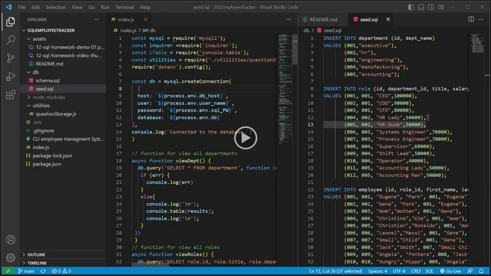

# SQL powered CLI employee managment System

## Description

This application provides a way to manage a business organizational structure with a CLI interface. The app takes advantage of mySQL databases to store and update persitent data.

## Table of Contents

- [Installation](#installation)
- [Usage](#usage)
- [Contributing](#contributing)
- [How-to-Contribute](#how-to-contribute)
- [Tests](#tests)
- [Questions](#questions)
- [License](#license)

## Installation

User will have to have mySQL installed onto his/her local machine, then run the schema.sql file in the db folder to set up the database. Run npm i in the CLI and the app will be ready to use. the optional seed.sql file can be run to test the functionality if needed.
for user credentials, end user must create a .env file with the following values populated

db_host = localhost
user_name = <mySQL User Name>
sql_PW = <mySQL Password>
db = employee_db

the schema file will create tables based on employee_db, end user must only provide the user name and password to their local instance of mySQL.

## Usage

the app is started by entering npm start in the CLI. prompts will be generated in the CLI to maintain and modify your company team. The options menu will seem to dissapear after making an entry but if you arrow key up or down the menu will re populate to continue usage.

Please see the linked video below.

## Contributing

N/A

## How-to-contribute

N/A

## Tests

N/A

## Questions

For any questions refer to the magicCrouton repository https://github.com/MagicCrouton/SQLEmployeeTracker 
or email inqueries to e.park5336@gmail.com

## License

This application is covered under the MIT license